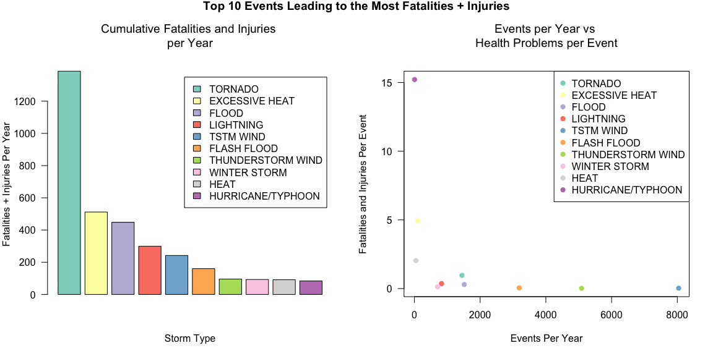
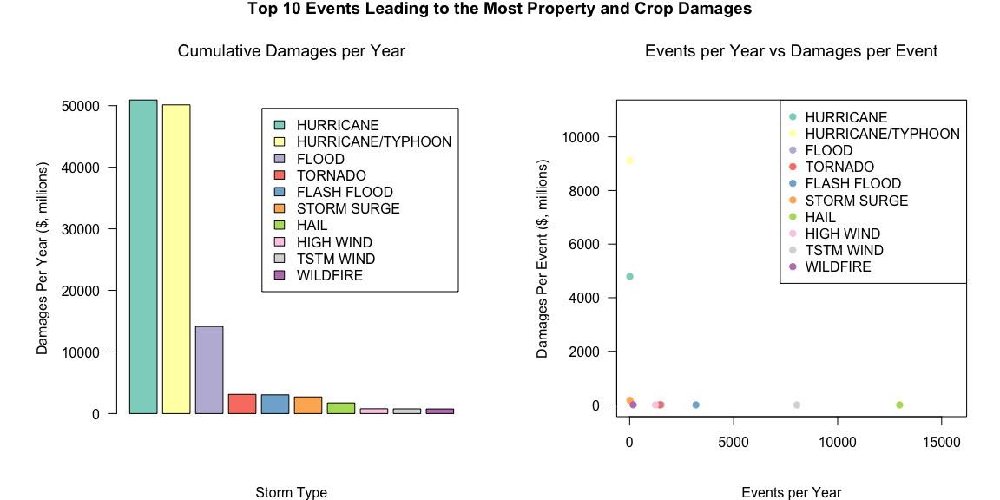

# Economic and Public Health Impact of Severe Weather
Katelyn Billings  
January 2015  

###Synopsis

This report aims to identify the types of storms that cause the most harm to 
public health and have the greatest economic consequences. To investigate this 
matter, storm data from the U.S. National Oceanic and Atmospheric Administration
were analyzed. The data documents when and where storms occurred and estimates 
the number of fatalities and injuries, as well as any crop or property damages. 
Only the data from 1996-2011 were used for analysis due to incomplete record
keeping in years prior to 1996. From the data it was identified that 
**tornados are the greatest cause of harm to public health** (as defined as the 
number of fatalities and injuries per year) while **hurricanes and hurricane/
typhoons have the greatest economic consequences** (as defined by the cost of 
property and crop damage per year).

###Key Questions

The following analysis addresses the following questions:

1. Across the United States, which types of events are most harmful with respect 
to population health?

2. Across the United States, which types of events have the greatest economic 
consequences?

This report should help someone prioritize resources for different types of 
events.

###Data Processing

From the U.S. National Oceanic and Atmospheric Administration's (NOAA) storm 
database, [data](https://d396qusza40orc.cloudfront.net/repdata%2Fdata%2FStormData.csv.bz2) 
on major storms and weather events in the United States were obtained for the 
period spanning 1950-2011. Only data from 1996-2011 will be used for data 
analysis however, due to incomplete record keeping prior to 1996. The data 
documents when and where the storms occur, as well as estimates of fatalities, 
injuries and any property or crop damage. More information on the database can 
be found here:

-National Weather Service Storm Database [Documentation](https://d396qusza40orc.cloudfront.net/repdata%2Fpeer2_doc%2Fpd01016005curr.pdf)

-National Climatic Data Center Storm Events [FAQ](https://d396qusza40orc.cloudfront.net/repdata%2Fpeer2_doc%2FNCDC%20Storm%20Events-FAQ%20Page.pdf)


#### Data Download

To begin the analysis, it is important to check if the 
[storm data](https://d396qusza40orc.cloudfront.net/repdata%2Fdata%2FStormData.csv.bz2) 
is already in the working directory. If it is not in the working directory, the 
file is downloaded and unzipped.


```r
if(!file.exists("./repdata-data-StormData.csv")){
    fileUrl <- "https://d396qusza40orc.cloudfront.net/repdata%2Fdata%2FStormData.csv.bz2"
    download.file(fileUrl, destfile = "./downloadedData", method = "curl")
    dateDownloaded <<- date()
    unzip("./downloadedData")
}
```


####Read in the Data

The raw comma-separated-value file included in the zip archive must then be read
into memory. NA values are indicated by the string "NA" or empty strings.


```r
originalStormData <- read.csv("./repdata-data-StormData.csv", 
                              na.strings = c("NA", ""))
```

A quick look at the data set:


```r
str(originalStormData)
```

```
## 'data.frame':	902297 obs. of  37 variables:
##  $ STATE__   : num  1 1 1 1 1 1 1 1 1 1 ...
##  $ BGN_DATE  : Factor w/ 16335 levels "1/1/1966 0:00:00",..: 6523 6523 4242 11116 2224 2224 2260 383 3980 3980 ...
##  $ BGN_TIME  : Factor w/ 3608 levels "00:00:00 AM",..: 272 287 2705 1683 2584 3186 242 1683 3186 3186 ...
##  $ TIME_ZONE : Factor w/ 22 levels "ADT","AKS","AST",..: 7 7 7 7 7 7 7 7 7 7 ...
##  $ COUNTY    : num  97 3 57 89 43 77 9 123 125 57 ...
##  $ COUNTYNAME: Factor w/ 29600 levels "5NM E OF MACKINAC BRIDGE TO PRESQUE ISLE LT MI",..: 13512 1872 4597 10591 4371 10093 1972 23872 24417 4597 ...
##  $ STATE     : Factor w/ 72 levels "AK","AL","AM",..: 2 2 2 2 2 2 2 2 2 2 ...
##  $ EVTYPE    : Factor w/ 985 levels "   HIGH SURF ADVISORY",..: 834 834 834 834 834 834 834 834 834 834 ...
##  $ BGN_RANGE : num  0 0 0 0 0 0 0 0 0 0 ...
##  $ BGN_AZI   : Factor w/ 34 levels "  N"," NW","E",..: NA NA NA NA NA NA NA NA NA NA ...
##  $ BGN_LOCATI: Factor w/ 54428 levels " Christiansburg",..: NA NA NA NA NA NA NA NA NA NA ...
##  $ END_DATE  : Factor w/ 6662 levels "1/1/1993 0:00:00",..: NA NA NA NA NA NA NA NA NA NA ...
##  $ END_TIME  : Factor w/ 3646 levels " 0900CST"," 200CST",..: NA NA NA NA NA NA NA NA NA NA ...
##  $ COUNTY_END: num  0 0 0 0 0 0 0 0 0 0 ...
##  $ COUNTYENDN: logi  NA NA NA NA NA NA ...
##  $ END_RANGE : num  0 0 0 0 0 0 0 0 0 0 ...
##  $ END_AZI   : Factor w/ 23 levels "E","ENE","ESE",..: NA NA NA NA NA NA NA NA NA NA ...
##  $ END_LOCATI: Factor w/ 34505 levels " CANTON"," TULIA",..: NA NA NA NA NA NA NA NA NA NA ...
##  $ LENGTH    : num  14 2 0.1 0 0 1.5 1.5 0 3.3 2.3 ...
##  $ WIDTH     : num  100 150 123 100 150 177 33 33 100 100 ...
##  $ F         : int  3 2 2 2 2 2 2 1 3 3 ...
##  $ MAG       : num  0 0 0 0 0 0 0 0 0 0 ...
##  $ FATALITIES: num  0 0 0 0 0 0 0 0 1 0 ...
##  $ INJURIES  : num  15 0 2 2 2 6 1 0 14 0 ...
##  $ PROPDMG   : num  25 2.5 25 2.5 2.5 2.5 2.5 2.5 25 25 ...
##  $ PROPDMGEXP: Factor w/ 18 levels "-","?","+","0",..: 16 16 16 16 16 16 16 16 16 16 ...
##  $ CROPDMG   : num  0 0 0 0 0 0 0 0 0 0 ...
##  $ CROPDMGEXP: Factor w/ 8 levels "?","0","2","B",..: NA NA NA NA NA NA NA NA NA NA ...
##  $ WFO       : Factor w/ 541 levels " CI","%SD","$AC",..: NA NA NA NA NA NA NA NA NA NA ...
##  $ STATEOFFIC: Factor w/ 249 levels "ALABAMA, Central",..: NA NA NA NA NA NA NA NA NA NA ...
##  $ ZONENAMES : Factor w/ 25111 levels "                                                                                                                               "| __truncated__,..: NA NA NA NA NA NA NA NA NA NA ...
##  $ LATITUDE  : num  3040 3042 3340 3458 3412 ...
##  $ LONGITUDE : num  8812 8755 8742 8626 8642 ...
##  $ LATITUDE_E: num  3051 0 0 0 0 ...
##  $ LONGITUDE_: num  8806 0 0 0 0 ...
##  $ REMARKS   : Factor w/ 436780 levels "\t","\t\t","\t\t\t\t",..: NA NA NA NA NA NA NA NA NA NA ...
##  $ REFNUM    : num  1 2 3 4 5 6 7 8 9 10 ...
```

####Clean the data

Any dependencies that are necessary for data analysis must be loaded.


```r
library(lubridate, warn.conflicts = FALSE, quietly = TRUE)
library(plyr, warn.conflicts = FALSE, quietly = TRUE)
library(dplyr, warn.conflicts = FALSE, quietly = TRUE)
```

Since this analysis is only concerned about which types of storms have the 
greatest economic consequences and impact on public health, only a subset of the 
data is retained: the storm type, fatalities/injuries, property/crop damages, 
and the corresponding scaling factor for the damages. 

Additionally, only the data reported from 1996-2011 will be kept due to 
incomplete record keeping prior to these years. 


```r
stormData <- select(originalStormData, date = BGN_DATE, storm.type = EVTYPE, 
                    fatalities = FATALITIES, injuries = INJURIES, 
                    property.damage = PROPDMG, property.exp = PROPDMGEXP, 
                    crop.damage = CROPDMG, crop.exp = CROPDMGEXP)
stormData$date <- mdy_hms(stormData$date)
stormData <- filter(stormData, year(date) >= 1996)
num.years <- length(unique(year(stormData$date)))
```

The structure of the data is now:


```r
str(stormData)
```

```
## 'data.frame':	653530 obs. of  8 variables:
##  $ date           : POSIXct, format: "1996-01-06" "1996-01-11" ...
##  $ storm.type     : Factor w/ 985 levels "   HIGH SURF ADVISORY",..: 972 834 856 856 856 244 359 856 856 856 ...
##  $ fatalities     : num  0 0 0 0 0 0 0 0 0 0 ...
##  $ injuries       : num  0 0 0 0 0 0 0 0 0 0 ...
##  $ property.damage: num  380 100 3 5 2 0 400 12 8 12 ...
##  $ property.exp   : Factor w/ 18 levels "-","?","+","0",..: 16 16 16 16 16 NA 16 16 16 16 ...
##  $ crop.damage    : num  38 0 0 0 0 0 0 0 0 0 ...
##  $ crop.exp       : Factor w/ 8 levels "?","0","2","B",..: 6 NA NA NA NA NA NA NA NA NA ...
```

Property and crop damage have a corresponding exponent/multiplier associated 
with them that must be accounted for. The levels and frequencies of the property 
and crop exponents are:


```r
table(stormData$property.exp, useNA = "ifany")
```

```
## 
##      -      ?      +      0      1      2      3      4      5      6 
##      0      0      0      1      0      0      0      0      0      0 
##      7      8      B      h      H      K      m      M   <NA> 
##      0      0     32      0      0 369938      0   7374 276185
```

```r
table(stormData$crop.exp, useNA = "ifany")
```

```
## 
##      ?      0      2      B      k      K      m      M   <NA> 
##      0      0      0      4      0 278686      0   1771 373069
```

The character based factor levels need to be reassigned to the corresponding 
numeric counterparts (eg. K stands for thousand so it gets reassigned to 3 
since 1000 = 10^3; likewise, M = 6, B = 9, NA = 0)


```r
# Reassign levels for property.exp, convert to a numeric
stormData$property.exp <- mapvalues(stormData$property.exp, 
                                    from = c("K", "M", "B"),
                                    to   = c("3", "6", "9"))
stormData[which(is.na(stormData$property.exp)), 6] <- "0"
stormData$property.exp <- as.numeric(as.character(stormData$property.exp))

# Reassign levels for crop.exp, convert to a numeric
stormData$crop.exp <- mapvalues(stormData$crop.exp, 
                                from = c("K", "M", "B"),
                                to   = c("3", "6", "9"))
stormData[which(is.na(stormData$crop.exp)), 8] <- "0"
stormData$crop.exp <- as.numeric(as.character(stormData$crop.exp))
```

A verification that the property and crop exponents were successfully 
reassigned:


```r
table(stormData$property.exp, useNA = "ifany")
```

```
## 
##      0      3      6      9 
## 276186 369938   7374     32
```

```r
table(stormData$crop.exp, useNA = "ifany")
```

```
## 
##      0      3      6      9 
## 373069 278686   1771      4
```

The property and crop damages must then be scaled by the corresponding 
exponents. The .exp variables are then dropped.


```r
stormData <- mutate(stormData, 
                    property.damage = property.damage * 10^property.exp,
                    crop.damage = crop.damage * 10^property.exp) %>%
             select(-c(date, property.exp, crop.exp))
```

The data can then be combined by storm type, averaging the results across the 
subset of years originally selected:


```r
summedData <- ddply(stormData, .(storm.type), summarize,
                    injuries.yr = sum(injuries)/num.years,
                    fatalities.yr = sum(fatalities)/num.years,
                    totalhealth.yr = sum(injuries + fatalities)/num.years,
                    propertydmg.yr = sum(property.damage)/num.years,
                    cropdmg.yr = sum(crop.damage)/num.years,
                    totaldmg.yr = sum(property.damage + crop.damage)/num.years)
```

The data now looks like:


```r
str(summedData)
```

```
## 'data.frame':	516 obs. of  7 variables:
##  $ storm.type    : Factor w/ 985 levels "   HIGH SURF ADVISORY",..: 1 2 3 4 5 6 7 8 10 11 ...
##  $ injuries.yr   : num  0 0 0 0 0 0 0 0 0 0 ...
##  $ fatalities.yr : num  0 0 0 0 0 0 0 0 0 0 ...
##  $ totalhealth.yr: num  0 0 0 0 0 0 0 0 0 0 ...
##  $ propertydmg.yr: num  12500 0 3125 0 506250 ...
##  $ cropdmg.yr    : num  0 0 0 0 0 0 0 0 0 0 ...
##  $ totaldmg.yr   : num  12500 0 3125 0 506250 ...
```

```r
summary(summedData)
```

```
##                  storm.type   injuries.yr       fatalities.yr    
##     HIGH SURF ADVISORY:  1   Min.   :   0.000   Min.   :  0.000  
##   COASTAL FLOOD       :  1   1st Qu.:   0.000   1st Qu.:  0.000  
##   FLASH FLOOD         :  1   Median :   0.000   Median :  0.000  
##   LIGHTNING           :  1   Mean   :   7.022   Mean   :  1.058  
##   TSTM WIND           :  1   3rd Qu.:   0.000   3rd Qu.:  0.000  
##   TSTM WIND (G45)     :  1   Max.   :1291.688   Max.   :112.312  
##  (Other)              :510                                       
##  totalhealth.yr      propertydmg.yr        cropdmg.yr       
##  Min.   :   0.0000   Min.   :0.000e+00   Min.   :0.000e+00  
##  1st Qu.:   0.0000   1st Qu.:0.000e+00   1st Qu.:0.000e+00  
##  Median :   0.0000   Median :0.000e+00   Median :0.000e+00  
##  Mean   :   8.0798   Mean   :4.442e+07   Mean   :2.091e+08  
##  3rd Qu.:   0.0625   3rd Qu.:1.875e+03   3rd Qu.:0.000e+00  
##  Max.   :1386.1250   Max.   :8.997e+09   Max.   :5.018e+10  
##                                                             
##   totaldmg.yr       
##  Min.   :0.000e+00  
##  1st Qu.:0.000e+00  
##  Median :0.000e+00  
##  Mean   :2.536e+08  
##  3rd Qu.:1.875e+03  
##  Max.   :5.092e+10  
## 
```

###Results

####Impact on Public Health

The first goal of this analysis is to identify which types of events are most 
harmful with respect to population health. This analysis identifies the leading
causes of injuries and fatalities both separately and combined on a per year 
basis. 

A look at what types of events occur most often on a per year basis:


```r
num.events <- as.data.frame(table(as.character(stormData$storm.type)))
summedData <- merge(summedData, num.events, by.x = "storm.type", by.y = "Var1")
summedData <- mutate(summedData, freq.yr = Freq/num.years) %>%
              select(-Freq)
by.events <- select(summedData, storm.type, freq.yr)
topten.events <- arrange(by.events, desc(freq.yr))[1:10, ]
topten.events[1:10, ]
```

```
##           storm.type    freq.yr
## 1               HAIL 12982.1875
## 2          TSTM WIND  8041.3750
## 3  THUNDERSTORM WIND  5087.6250
## 4        FLASH FLOOD  3187.4375
## 5              FLOOD  1515.4375
## 6            TORNADO  1447.1250
## 7          HIGH WIND  1244.1875
## 8         HEAVY SNOW   875.0000
## 9          LIGHTNING   825.1875
## 10        HEAVY RAIN   719.3125
```

The top ten causes of fatalities/year are: 


```r
# Get top ten causes of fatalities/year
by.fatalities <- select(summedData, storm.type, fatalities.yr, freq.yr)
topten.fatalities <- arrange(by.fatalities, desc(fatalities.yr))[1:10, ]
topten.fatalities <- mutate(topten.fatalities, 
                            fatalities.event = round(fatalities.yr/freq.yr, 4))
topten.fatalities[ ,c(1,2,4)]
```

```
##        storm.type fatalities.yr fatalities.event
## 1  EXCESSIVE HEAT      112.3125           1.0851
## 2         TORNADO       94.4375           0.0653
## 3     FLASH FLOOD       55.4375           0.0174
## 4       LIGHTNING       40.6875           0.0493
## 5           FLOOD       25.8750           0.0171
## 6     RIP CURRENT       21.2500           0.7870
## 7       TSTM WIND       15.0625           0.0019
## 8            HEAT       14.8125           0.3310
## 9       HIGH WIND       14.6875           0.0118
## 10      AVALANCHE       13.9375           0.5899
```

The top ten causes of injuries/year are:


```r
# Get top ten causes of injuries/year
by.injuries <- select(summedData, storm.type, injuries.yr, freq.yr)
topten.injuries <- arrange(by.injuries, desc(injuries.yr))[1:10, ]
topten.injuries <- mutate(topten.injuries,
                          injuries.event = round(injuries.yr/freq.yr, 4))
topten.injuries[ , c(1,2,4)]
```

```
##           storm.type injuries.yr injuries.event
## 1            TORNADO   1291.6875         0.8926
## 2              FLOOD    422.3750         0.2787
## 3     EXCESSIVE HEAT    399.4375         3.8593
## 4          LIGHTNING    258.8125         0.3136
## 5          TSTM WIND    226.8125         0.0282
## 6        FLASH FLOOD    104.6250         0.0328
## 7  THUNDERSTORM WIND     87.5000         0.0172
## 8       WINTER STORM     80.7500         0.1142
## 9  HURRICANE/TYPHOON     79.6875        14.4886
## 10              HEAT     76.3750         1.7067
```

The top ten causes of all health problems (fatalities + injuries) per year are:


```r
# Get top ten causes of health problems
by.health <- select(summedData, storm.type, totalhealth.yr, freq.yr)
topten.health <- arrange(by.health, desc(totalhealth.yr))[1:10, ]
topten.health <- mutate(topten.health, 
                        totalhealth.event = round(totalhealth.yr/freq.yr, 4))
topten.health[ , c(1,2,4)]
```

```
##           storm.type totalhealth.yr totalhealth.event
## 1            TORNADO      1386.1250            0.9578
## 2     EXCESSIVE HEAT       511.7500            4.9444
## 3              FLOOD       448.2500            0.2958
## 4          LIGHTNING       299.5000            0.3629
## 5          TSTM WIND       241.8750            0.0301
## 6        FLASH FLOOD       160.0625            0.0502
## 7  THUNDERSTORM WIND        95.6250            0.0188
## 8       WINTER STORM        92.6875            0.1310
## 9               HEAT        91.1875            2.0377
## 10 HURRICANE/TYPHOON        83.6875           15.2159
```

A graphical look at the top ten events leading to the most fatalities and 
injuries:


```r
# Display information in graphical form
library(RColorBrewer)
par(mfrow = c(1, 2), las = 1, mar = c(5, 4, 6, 2))
with(topten.health, 
     barplot(totalhealth.yr, 
             xlab = "Storm Type",
             ylab = "Fatalities + Injuries Per Year",
             main = paste0("Cumulative Fatalities and Injuries \nper Year"),
             font.main = 1,
             cex.names = 0.6,
             col = brewer.pal(10, "Set3"),
             legend.text = storm.type))     
with(topten.health,     
     plot(freq.yr, totalhealth.event,
          main = paste0("Events per Year vs \nHealth Problems per Event"),
          font.main = 1,
          xlab = "Events Per Year",
          ylab = "Fatalities and Injuries Per Event",
          pch = 19,
          col = brewer.pal(10, "Set3")))
with(topten.health, legend("topright", legend = storm.type, pch = 19, 
                           col = brewer.pal(10, "Set3"), cex = 1))
mtext("Top 10 Events Leading to the Most Fatalities + Injuries", side = 3, 
      line = -1, outer = TRUE, cex = 1.2, font = 2)
```



The resulting graph is quite interesting: of the top ten events that cause the 
most harm to public health, TORNADO causes the most number of 
health problems per year with 1386.125 health problems, yet only 
causes 1447.125 health problems per event in the year. 

In fact, for the majority of the events that cause the most harm to public 
health each year, the corresponding number fatalities + injuries per events is 
close to zero. This suggests that the individual events cause minimal harm, but 
because there are so many events each year, the sum of all harm becomes 
substantial.

####Greatest Economic Consequences

The second goal of this analysis is to identify the types of storms that have
the greatest economic consequences. For this analysis, economic consequences
refers to property and crop damage (in millions of dollars).

The top ten causes of property damage per year ($, millions) are:


```r
# Get top ten causes of property damage ($, millions)
by.property <- select(summedData, storm.type, propertydmg.yr, freq.yr)
topten.property <- arrange(by.property, desc(propertydmg.yr))[1:10, ]
topten.property <- mutate(topten.property, 
                          propertydmg.yr = propertydmg.yr/10^6,
                          propertydmg.event = round(propertydmg.yr/freq.yr, 4))
topten.property[ , c(1,2,4)]
```

```
##           storm.type propertydmg.yr propertydmg.event
## 1              FLOOD      8996.5521            5.9366
## 2  HURRICANE/TYPHOON      4331.6150          787.5664
## 3        STORM SURGE      2699.5960          170.7254
## 4            TORNADO      1538.5591            1.0632
## 5        FLASH FLOOD       951.3877            0.2985
## 6               HAIL       912.1965            0.0703
## 7          HURRICANE       738.3012           69.4872
## 8     TROPICAL STORM       477.6547           11.2060
## 9          HIGH WIND       327.9913            0.2636
## 10          WILDFIRE       297.4167            1.7418
```

The top ten causes of crop damage per year ($, millions) are:


```r
# Get top ten causes of crop damage ($, millions)
by.crop <- select(summedData, storm.type, cropdmg.yr, freq.yr)
topten.crop <- arrange(by.crop, desc(cropdmg.yr))[1:10, ]
topten.crop <- mutate(topten.crop,
                      cropdmg.yr = cropdmg.yr/10^6,
                      cropdmg.event = round(cropdmg.yr/freq.yr, 4))
topten.crop[ , c(1,2,4)]
```

```
##           storm.type cropdmg.yr cropdmg.event
## 1          HURRICANE 50180.0885     4722.8319
## 2  HURRICANE/TYPHOON 45798.0282     8326.9142
## 3              FLOOD  5138.2200        3.3906
## 4        FLASH FLOOD  2090.4577        0.6558
## 5            TORNADO  1581.6911        1.0930
## 6               HAIL   810.4125        0.0624
## 7          TSTM WIND   479.3494        0.0596
## 8          HIGH WIND   448.3785        0.3604
## 9           WILDFIRE   448.3631        2.6258
## 10 THUNDERSTORM WIND   337.8949        0.0664
```

The top ten causes of property and crop damage combined per year ($, millions) 
are:


```r
# Get the top ten causes of total damage ($, millions)
by.totaldmg <- select(summedData, storm.type, totaldmg.yr, freq.yr)
topten.totaldmg <- arrange(by.totaldmg, desc(totaldmg.yr))[1:10, ]
topten.totaldmg <- mutate(topten.totaldmg,
                          totaldmg.yr = totaldmg.yr/10^6,
                          totaldmg.event = round(totaldmg.yr/freq.yr, 4))
topten.totaldmg[ , c(1,2,4)]
```

```
##           storm.type totaldmg.yr totaldmg.event
## 1          HURRICANE  50918.3897      4792.3190
## 2  HURRICANE/TYPHOON  50129.6432      9114.4806
## 3              FLOOD  14134.7721         9.3272
## 4            TORNADO   3120.2502         2.1562
## 5        FLASH FLOOD   3041.8454         0.9543
## 6        STORM SURGE   2699.9085       170.7452
## 7               HAIL   1722.6090         0.1327
## 8          HIGH WIND    776.3698         0.6240
## 9          TSTM WIND    759.2261         0.0944
## 10          WILDFIRE    745.7798         4.3677
```

The top ten causes of property and crop damage per event ($, millions)


```r
# Display causes of property/crop damage in graphical form
par(mfrow = c(1, 2), las = 1, mar = c(5, 7, 6, 2), mgp = c(4, 1, 0))
with(topten.totaldmg, 
     barplot(totaldmg.yr, 
             xlab = "Storm Type",
             ylab = "Damages Per Year ($, millions)",
             main = paste0("Cumulative Damages per Year"),
             font.main = 1,
             cex.names = 0.6,
             col = brewer.pal(10, "Set3"),
             legend.text = storm.type))
with(topten.totaldmg, plot(freq.yr, totaldmg.event,
                           main = "Events per Year vs Damages per Event",
                           font.main = 1,
                           xlab = "Events per Year",
                           xlim = c(0, max(freq.yr)*1.2),
                           ylab = "Damages Per Event ($, millions)",
                           ylim = c(0, max(totaldmg.event)*1.2),
                           pch = 19,
                           col = brewer.pal(10, "Set3")))
with(topten.totaldmg, legend("topright", legend = storm.type, pch = 19,
                             col = brewer.pal(10, "Set3"), cex = 1))
mtext("Top 10 Events Leading to the Most Property and Crop Damages", side = 3,
      line = -1, outer = TRUE, cex = 1.2, font = 2)
```



This graph indicates that HURRICANE has the greatest economic 
consequences with 5.091839\times 10^{4} million dollars of damage each year
and 4792.319 million dollars of damage each event to property
and crops. In second is HURRICANE/TYPHOON with 5.0129643\times 10^{4}
million dollars of damage each year and 9114.4806 million dollars
of damage each event. In contrast to the events which caused the most harm with 
respect to public health, these events cause the most economic damage with very 
few events per year and as a result have a high economic cost per event. 
