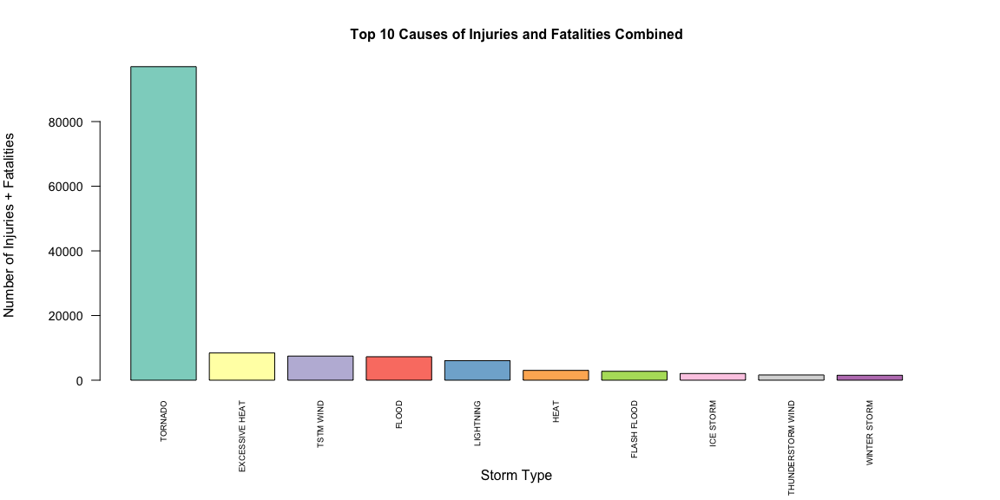

# Economic and Public Health Impact of Severe Weather
Katelyn Billings  
January 14, 2015  

###Synopsis

###Key Questions

The data analysis addresses the following questions:

1. Across the United States, which types of events (as indicated in the EVTYPE 
variable) are most harmful with respect to population health?

2. Across the United States, which types of events have the greatest economic 
consequences?

The analysis should help someone prioritize resources for different types of 
events.

###Data Processing

From the U.S. National Oceanic and Atmospheric Administration's (NOAA) storm 
database, we obtained data on major storms and weather events in the United 
States, including when and where they occur, as well as estimates of any 
fatalities, injuries, and property damage.

#### Data Download

We first check if the data has already been downloaded from the 
[NOAA Storm Database](https://d396qusza40orc.cloudfront.net/repdata%2Fdata%2FStormData.csv.bz2).
If it does not exist, the file is downloaded and unzipped.


```r
if(!file.exists("./repdata-data-StormData.csv")){
    fileUrl <- "https://d396qusza40orc.cloudfront.net/repdata%2Fdata%2FStormData.csv.bz2"
    download.file(fileUrl, destfile = "./downloadedData", method = "curl")
    dateDownloaded <<- date()
    unzip("./downloadedData")
}
```


####Read in the Data

We then read in the raw comma-separated-value file included in the zip archive.
NA values are indicated by the string "NA" or empty strings.


```r
originalStormData <- read.csv("./repdata-data-StormData.csv", 
                              na.strings = c("NA", ""))
```

A quick look at the data set:


```r
str(originalStormData)
```

```
## 'data.frame':	902297 obs. of  37 variables:
##  $ STATE__   : num  1 1 1 1 1 1 1 1 1 1 ...
##  $ BGN_DATE  : Factor w/ 16335 levels "1/1/1966 0:00:00",..: 6523 6523 4242 11116 2224 2224 2260 383 3980 3980 ...
##  $ BGN_TIME  : Factor w/ 3608 levels "00:00:00 AM",..: 272 287 2705 1683 2584 3186 242 1683 3186 3186 ...
##  $ TIME_ZONE : Factor w/ 22 levels "ADT","AKS","AST",..: 7 7 7 7 7 7 7 7 7 7 ...
##  $ COUNTY    : num  97 3 57 89 43 77 9 123 125 57 ...
##  $ COUNTYNAME: Factor w/ 29600 levels "5NM E OF MACKINAC BRIDGE TO PRESQUE ISLE LT MI",..: 13512 1872 4597 10591 4371 10093 1972 23872 24417 4597 ...
##  $ STATE     : Factor w/ 72 levels "AK","AL","AM",..: 2 2 2 2 2 2 2 2 2 2 ...
##  $ EVTYPE    : Factor w/ 985 levels "   HIGH SURF ADVISORY",..: 834 834 834 834 834 834 834 834 834 834 ...
##  $ BGN_RANGE : num  0 0 0 0 0 0 0 0 0 0 ...
##  $ BGN_AZI   : Factor w/ 34 levels "  N"," NW","E",..: NA NA NA NA NA NA NA NA NA NA ...
##  $ BGN_LOCATI: Factor w/ 54428 levels " Christiansburg",..: NA NA NA NA NA NA NA NA NA NA ...
##  $ END_DATE  : Factor w/ 6662 levels "1/1/1993 0:00:00",..: NA NA NA NA NA NA NA NA NA NA ...
##  $ END_TIME  : Factor w/ 3646 levels " 0900CST"," 200CST",..: NA NA NA NA NA NA NA NA NA NA ...
##  $ COUNTY_END: num  0 0 0 0 0 0 0 0 0 0 ...
##  $ COUNTYENDN: logi  NA NA NA NA NA NA ...
##  $ END_RANGE : num  0 0 0 0 0 0 0 0 0 0 ...
##  $ END_AZI   : Factor w/ 23 levels "E","ENE","ESE",..: NA NA NA NA NA NA NA NA NA NA ...
##  $ END_LOCATI: Factor w/ 34505 levels " CANTON"," TULIA",..: NA NA NA NA NA NA NA NA NA NA ...
##  $ LENGTH    : num  14 2 0.1 0 0 1.5 1.5 0 3.3 2.3 ...
##  $ WIDTH     : num  100 150 123 100 150 177 33 33 100 100 ...
##  $ F         : int  3 2 2 2 2 2 2 1 3 3 ...
##  $ MAG       : num  0 0 0 0 0 0 0 0 0 0 ...
##  $ FATALITIES: num  0 0 0 0 0 0 0 0 1 0 ...
##  $ INJURIES  : num  15 0 2 2 2 6 1 0 14 0 ...
##  $ PROPDMG   : num  25 2.5 25 2.5 2.5 2.5 2.5 2.5 25 25 ...
##  $ PROPDMGEXP: Factor w/ 18 levels "-","?","+","0",..: 16 16 16 16 16 16 16 16 16 16 ...
##  $ CROPDMG   : num  0 0 0 0 0 0 0 0 0 0 ...
##  $ CROPDMGEXP: Factor w/ 8 levels "?","0","2","B",..: NA NA NA NA NA NA NA NA NA NA ...
##  $ WFO       : Factor w/ 541 levels " CI","%SD","$AC",..: NA NA NA NA NA NA NA NA NA NA ...
##  $ STATEOFFIC: Factor w/ 249 levels "ALABAMA, Central",..: NA NA NA NA NA NA NA NA NA NA ...
##  $ ZONENAMES : Factor w/ 25111 levels "                                                                                                                               "| __truncated__,..: NA NA NA NA NA NA NA NA NA NA ...
##  $ LATITUDE  : num  3040 3042 3340 3458 3412 ...
##  $ LONGITUDE : num  8812 8755 8742 8626 8642 ...
##  $ LATITUDE_E: num  3051 0 0 0 0 ...
##  $ LONGITUDE_: num  8806 0 0 0 0 ...
##  $ REMARKS   : Factor w/ 436780 levels "\t","\t\t","\t\t\t\t",..: NA NA NA NA NA NA NA NA NA NA ...
##  $ REFNUM    : num  1 2 3 4 5 6 7 8 9 10 ...
```

####Clean the data

We need to load any dependencies that will be required for data analysis.


```r
library(lubridate, warn.conflicts = FALSE, quietly = TRUE)
library(plyr, warn.conflicts = FALSE, quietly = TRUE)
library(dplyr, warn.conflicts = FALSE, quietly = TRUE)
```

Since we are only concerned about which types of storms have the greatest 
economic consequences and impact on public health, only a subset of the data 
will be retained: the storm type, fatalities/injuries, and property/crop damages.


```r
stormData <- select(originalStormData, date = BGN_DATE, storm.type = EVTYPE, 
                    fatalities = FATALITIES, injuries = INJURIES, 
                    property.damage = PROPDMG, property.exp = PROPDMGEXP, 
                    crop.damage = CROPDMG, crop.exp = CROPDMGEXP)
stormData$date <- mdy_hms(stormData$date)
```

The structure of the data is now:


```r
str(stormData)
```

```
## 'data.frame':	902297 obs. of  8 variables:
##  $ date           : POSIXct, format: "1950-04-18" "1950-04-18" ...
##  $ storm.type     : Factor w/ 985 levels "   HIGH SURF ADVISORY",..: 834 834 834 834 834 834 834 834 834 834 ...
##  $ fatalities     : num  0 0 0 0 0 0 0 0 1 0 ...
##  $ injuries       : num  15 0 2 2 2 6 1 0 14 0 ...
##  $ property.damage: num  25 2.5 25 2.5 2.5 2.5 2.5 2.5 25 25 ...
##  $ property.exp   : Factor w/ 18 levels "-","?","+","0",..: 16 16 16 16 16 16 16 16 16 16 ...
##  $ crop.damage    : num  0 0 0 0 0 0 0 0 0 0 ...
##  $ crop.exp       : Factor w/ 8 levels "?","0","2","B",..: NA NA NA NA NA NA NA NA NA NA ...
```

We now need to take into account the fact that property and crop damage have a 
corresponding exponent/multiplier associated with them. Let's look at the levels
and frequencies of the property and crop exponents:


```r
table(stormData$property.exp, useNA = "ifany")
```

```
## 
##      -      ?      +      0      1      2      3      4      5      6 
##      1      8      5    216     25     13      4      4     28      4 
##      7      8      B      h      H      K      m      M   <NA> 
##      5      1     40      1      6 424665      7  11330 465934
```

```r
table(stormData$crop.exp, useNA = "ifany")
```

```
## 
##      ?      0      2      B      k      K      m      M   <NA> 
##      7     19      1      9     21 281832      1   1994 618413
```

It is unclear what factor levels -, ?, + mean so we will remove the data that
contain these factor levels:


```r
stormData <- stormData[grep("\\-|\\?|\\+", stormData$property.exp, 
                       invert = TRUE), ]
stormData <- stormData[grep("\\?", stormData$crop.exp, invert = TRUE), ]
```

We now need to reassign the character levels to their corresponding numeric 
counterparts: h/H = 2, k/K = 3, m/M = 6, b/B = 9, NA = 0


```r
# Reassign levels for property.exp, convert to a numeric
stormData$property.exp <- mapvalues(stormData$property.exp, 
                                    from = c("h", "H", "K", "m", "M", "B"),
                                    to   = c("2", "2", "3", "6", "6", "9"))
stormData[which(is.na(stormData$property.exp)), 6] <- "0"
stormData$property.exp <- as.numeric(as.character(stormData$property.exp))

# Reassign levels for crop.exp, convert to a numeric
stormData$crop.exp <- mapvalues(stormData$crop.exp, 
                                from = c("k", "K", "m", "M", "B"),
                                to   = c("3", "3", "6", "6", "9"))
stormData[which(is.na(stormData$crop.exp)), 8] <- "0"
stormData$crop.exp <- as.numeric(as.character(stormData$crop.exp))
```

Let's make sure the property and crop exponents were successfully reassigned:


```r
table(stormData$property.exp, useNA = "ifany")
```

```
## 
##      0      1      2      3      4      5      6      7      8      9 
## 466148     25     20 424665      4     28  11340      5      1     40
```

```r
table(stormData$crop.exp, useNA = "ifany")
```

```
## 
##      0      2      3      6      9 
## 618418      1 281853   1995      9
```

Finally, we need to multiply the property damage by their corresponding 
exponents then remove the .exp variables.


```r
stormData <- mutate(stormData, 
                    property.damage = property.damage * 10^property.exp,
                    crop.damage = crop.damage * 10^property.exp) %>%
             select(-c(property.exp, crop.exp))
```

Our data now looks like:


```r
str(stormData)
```

```
## 'data.frame':	902276 obs. of  6 variables:
##  $ date           : POSIXct, format: "1950-04-18" "1950-04-18" ...
##  $ storm.type     : Factor w/ 985 levels "   HIGH SURF ADVISORY",..: 834 834 834 834 834 834 834 834 834 834 ...
##  $ fatalities     : num  0 0 0 0 0 0 0 0 1 0 ...
##  $ injuries       : num  15 0 2 2 2 6 1 0 14 0 ...
##  $ property.damage: num  25000 2500 25000 2500 2500 2500 2500 2500 25000 25000 ...
##  $ crop.damage    : num  0 0 0 0 0 0 0 0 0 0 ...
```

```r
summary(stormData)
```

```
##       date                                 storm.type    
##  Min.   :1950-01-03 00:00:00   HAIL             :288658  
##  1st Qu.:1995-04-20 00:00:00   TSTM WIND        :219940  
##  Median :2002-03-18 00:00:00   THUNDERSTORM WIND: 82562  
##  Mean   :1998-12-28 00:26:59   TORNADO          : 60651  
##  3rd Qu.:2007-07-28 00:00:00   FLASH FLOOD      : 54275  
##  Max.   :2011-11-30 00:00:00   FLOOD            : 25326  
##                                (Other)          :170864  
##    fatalities          injuries         property.damage    
##  Min.   :  0.0000   Min.   :   0.0000   Min.   :0.000e+00  
##  1st Qu.:  0.0000   1st Qu.:   0.0000   1st Qu.:0.000e+00  
##  Median :  0.0000   Median :   0.0000   Median :0.000e+00  
##  Mean   :  0.0168   Mean   :   0.1557   Mean   :4.746e+05  
##  3rd Qu.:  0.0000   3rd Qu.:   0.0000   3rd Qu.:5.000e+02  
##  Max.   :583.0000   Max.   :1700.0000   Max.   :1.150e+11  
##                                                            
##   crop.damage       
##  Min.   :0.000e+00  
##  1st Qu.:0.000e+00  
##  Median :0.000e+00  
##  Mean   :1.967e+06  
##  3rd Qu.:0.000e+00  
##  Max.   :5.000e+11  
## 
```

###Results

####Impact on Public Health

We need to figure out which types of events are most harmful with respect to 
population health. First let's look at what types of events occur most often.


```r
num.events <- as.data.frame(table(as.character(stormData$storm.type)))
arrange(num.events, desc(Freq))[1:10, ]
```

```
##                  Var1   Freq
## 1                HAIL 288658
## 2           TSTM WIND 219940
## 3   THUNDERSTORM WIND  82562
## 4             TORNADO  60651
## 5         FLASH FLOOD  54275
## 6               FLOOD  25326
## 7  THUNDERSTORM WINDS  20837
## 8           HIGH WIND  20210
## 9           LIGHTNING  15754
## 10         HEAVY SNOW  15708
```

Let's look at the top ten causes of fatalities and injuries: 


```r
# Get top ten causes of fatalities
health.fatalities <- group_by(stormData, storm.type) %>%
                     summarize(fatalities = sum(fatalities, na.rm = TRUE))
topten.fatalities <- arrange(health.fatalities, desc(fatalities))[1:10, ]
topten.fatalities
```

```
## Source: local data frame [10 x 2]
## 
##        storm.type fatalities
## 1         TORNADO       5633
## 2  EXCESSIVE HEAT       1903
## 3     FLASH FLOOD        978
## 4            HEAT        937
## 5       LIGHTNING        816
## 6       TSTM WIND        504
## 7           FLOOD        470
## 8     RIP CURRENT        368
## 9       HIGH WIND        246
## 10      AVALANCHE        224
```


```r
# Get top ten causes of injuries
health.injuries <- group_by(stormData, storm.type) %>%
                   summarize(injuries = sum(injuries, na.rm = TRUE))
topten.injuries <- arrange(health.injuries, desc(injuries))[1:10, ]
topten.injuries
```

```
## Source: local data frame [10 x 2]
## 
##           storm.type injuries
## 1            TORNADO    91346
## 2          TSTM WIND     6957
## 3              FLOOD     6789
## 4     EXCESSIVE HEAT     6525
## 5          LIGHTNING     5230
## 6               HEAT     2100
## 7          ICE STORM     1975
## 8        FLASH FLOOD     1777
## 9  THUNDERSTORM WIND     1488
## 10              HAIL     1361
```

Finally, let's look at the top ten causes of all health problems (fatalities +
injuries) and display the results in a bar plot:


```r
# Get top ten causes of health problems
health.problems <- group_by(stormData, storm.type) %>%
                   summarize(problems = sum(injuries + fatalities, na.rm = TRUE))
topten.problems <- arrange(health.problems, desc(problems))[1:10, ]
topten.problems
```

```
## Source: local data frame [10 x 2]
## 
##           storm.type problems
## 1            TORNADO    96979
## 2     EXCESSIVE HEAT     8428
## 3          TSTM WIND     7461
## 4              FLOOD     7259
## 5          LIGHTNING     6046
## 6               HEAT     3037
## 7        FLASH FLOOD     2755
## 8          ICE STORM     2064
## 9  THUNDERSTORM WIND     1621
## 10      WINTER STORM     1527
```


```r
# Display information in graphical form
library(RColorBrewer)
par(mfcol=c(1,1), mar = c(7,6,4,4), las = 2, cex.main = 1, cex.axis = 0.9,
    mgp = c(5, 1, 0))
with(topten.problems, barplot(problems, names.arg = storm.type,
                              xlab = "Storm Type",
                              ylab = "Number of Injuries + Fatalities",
                              main = "Top 10 Causes of Injuries and Fatalities Combined",
                              cex.names = 0.6,
                              col = brewer.pal(10, "Set3")))
```

 

From the plot above, we see that TORNADO is the most harmful
type of event to personal health at 9.6979\times 10^{4} injuries and 
fatalities combined. The level of harm drops off afterwards, with
EXCESSIVE HEAT being the second leading cause of harm with 
8428 health incidents.


####Greatest Economic Consequences

In terms of economic consequences, we are concerned with the amount of property
and crop damage caused by a given storm type. Let's first look at the top ten 
causes of property and crop damage separately ($, billions):


```r
# Get top ten causes of property damage ($, billions)
econ.property <- group_by(stormData, storm.type) %>%
                 summarize(property.damage = sum(property.damage/10^9, 
                                                 na.rm = TRUE))
topten.property <- arrange(econ.property, desc(property.damage))[1:10, ]
topten.property
```

```
## Source: local data frame [10 x 2]
## 
##           storm.type property.damage
## 1              FLOOD      144.657710
## 2  HURRICANE/TYPHOON       69.305840
## 3            TORNADO       56.947381
## 4        STORM SURGE       43.323536
## 5        FLASH FLOOD       16.822674
## 6               HAIL       15.735268
## 7          HURRICANE       11.868319
## 8     TROPICAL STORM        7.703891
## 9       WINTER STORM        6.688497
## 10         HIGH WIND        5.270046
```


```r
# Get top ten causes of crop damage ($, billions)
econ.crop <- group_by(stormData, storm.type) %>%
             summarize(crop.damage = sum(crop.damage/10^9, na.rm = TRUE))
topten.crop <- arrange(econ.crop, desc(crop.damage))[1:10, ]
topten.crop
```

```
## Source: local data frame [10 x 2]
## 
##                   storm.type crop.damage
## 1                  HURRICANE  802.881916
## 2          HURRICANE/TYPHOON  732.768451
## 3                      FLOOD   87.251978
## 4                FLASH FLOOD   38.865140
## 5                    TORNADO   28.269879
## 6                       HAIL   15.316824
## 7  HURRICANE OPAL/HIGH WINDS   10.000000
## 8                  TSTM WIND    7.684658
## 9                  HIGH WIND    7.174066
## 10                  WILDFIRE    7.173809
```

Finally let's look at the top ten causes of property and crop damage combined
($, billions) and display the results in a bar plot:


```r
# Get the top ten causes of total damage ($, billions)
econ.total <- group_by(stormData, storm.type) %>%
              summarize(total.damage = sum(property.damage + crop.damage, 
                                           na.rm = TRUE)/10^9)
topten.total <- arrange(econ.total, desc(total.damage))[1:10, ]
topten.total
```

```
## Source: local data frame [10 x 2]
## 
##           storm.type total.damage
## 1          HURRICANE    814.75024
## 2  HURRICANE/TYPHOON    802.07429
## 3              FLOOD    231.90969
## 4            TORNADO     85.21726
## 5        FLASH FLOOD     55.68781
## 6        STORM SURGE     43.32854
## 7               HAIL     31.05209
## 8          HIGH WIND     12.44411
## 9          TSTM WIND     12.16959
## 10          WILDFIRE     11.93892
```


```r
# Display causes of property/crop damage in graphical form
par(mfcol=c(1,1), mar = c(7,6,4,4), las = 2, cex.main = 1, cex.axis = 0.9, 
    mgp = c(5, 1, 0))
with(topten.total, barplot(total.damage, names.arg = storm.type,
                           xlab = "Storm Type",
                           ylab = "Property + Crop Damage ($, billions)",
                           main = "Top 10 Causes of Property and Crop Damage",
                           cex.names = 0.6,
                           col = brewer.pal(10, "Set3")))
```

 

From the plot above, we see that HURRICANE causes the most damage 
economically with 814.7502351 billion dollars of damage to property
and crops. HURRICANE/TYPHOON is the second most costly type of
storm with 802.0742913 billion dollars of damage to property and
crops.
